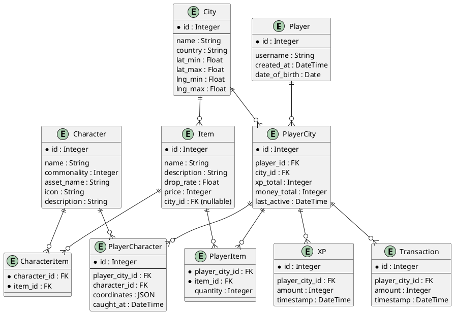

# Brainrotism

FastAPI app using Poetry, SQLite and SQLAlchemy.

Quickstart

1. Install Poetry: https://python-poetry.org/
2. From repository root run:

```bash
poetry install
poetry run uvicorn app:app --reload
```


---

### Auth & Player

* `POST /players/register` → Create a new player account
* `POST /players/login` → Authenticate player
* `GET /players/{player_id}` → Fetch player profile (username, DOB, created_at)

### City (hardcoded)

* `GET /city` → Return info about the current city (bounds, name, etc.)

### Player Progress (per city)

* `POST /playercity/join` → Attach player to the hardcoded city, initialize xp/money
* `GET /playercity/{player_id}` → Get player’s progress in the city (xp, money, last active)
* `PATCH /playercity/{player_id}/update` → Update xp, money totals (after actions)

### Characters

  * `GET /characters` → List all available characters (global)
  * `GET /characters/{id}` → Fetch details of a single character
  * `POST /playercharacters/catch` → Player captures a character (requires coordinates)
  * `GET /playercharacters/{player_id}` → List all characters caught by a player in the city

### Items

* `GET /items` → List all items (both global and city-specific)
* `GET /items/{id}` → Fetch details about one item
* `POST /playeritems/add` → Add an item to player inventory (loot drop, purchase, etc.)
* `GET /playeritems/{player_id}` → List all items a player owns in the city
* `PATCH /playeritems/{player_id}/{item_id}/use` → Use or consume an item

### Economy

* `POST /transactions/create` → Record a money transaction (gain/spend)
* `GET /transactions/{player_id}` → Get all transactions for a player
* `POST /xp/add` → Add an XP entry for a player
* `GET /xp/{player_id}` → Get XP history for a player

### Leaderboard

* `GET /leaderboard/` → Get leaderboard of players ranked by total XP in the city

### Admin / Debug (optional)

* `POST /characters/spawn` → Spawn a character instance at coordinates (testing)
* `POST /items/drop` → Force-drop an item for a player (testing)